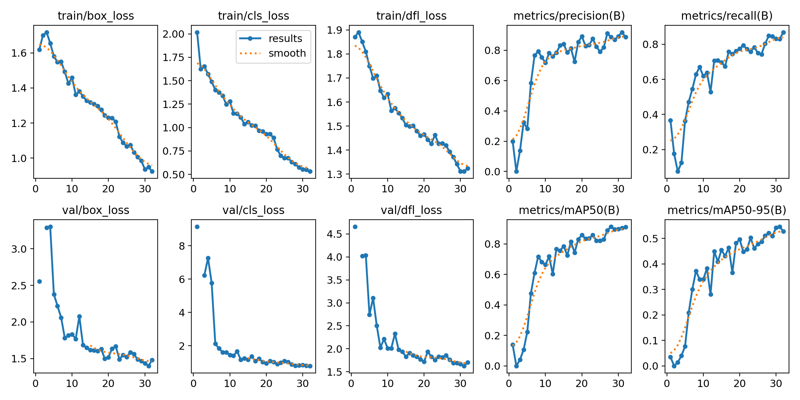

# Drone Detection and Tracking using YOLOv11x

[](LICENSE)       [](https://huggingface.co/doguilmak/Drone-Detection-YOLOv11x/tree/main/weight) 


## Quickstart

- Install dependencies (CPU example):
  - `pip install --upgrade ultralytics opencv-python numpy`
  - For GPU, install a matching PyTorch build for your CUDA, e.g. `pip install --index-url https://download.pytorch.org/whl/cu124 torch torchvision torchaudio`
- Ensure a weights file is present in the project root (default: `jawji.pt`). You can use your own or download from the HuggingFace link below.
- Run prediction on the sample image and display the window:
  - `python detect_drone.py --source test.jpeg --model jawji.pt --show`


## CLI Usage

The script supports images, videos, directories/globs, and webcam input. Outputs are saved under `runs/<name>`.

Examples:

- Image inference:
  - `python detect_drone.py --source test.jpeg --model jawji.pt`
- Video file inference:
  - `python detect_drone.py --source path/to/video.mp4 --model jawji.pt`
- Webcam detection with display:
  - `python detect_drone.py --source 0 --model jawji.pt --show`
- Enable tracking on video/webcam (uses Ultralytics built-in tracker):
  - `python detect_drone.py --source 0 --model jawji.pt --track --show`
- Heatmap visualization and overlay for video/webcam:
  - `python detect_drone.py --source path/to/video.mp4 --model jawji.pt --heatmap --show`
- Filter by class IDs (e.g., only class 0):
  - `python detect_drone.py --source test.jpeg --model jawji.pt --classes 0`
- Control output directory and run name:
  - `python detect_drone.py --source test.jpeg --model jawji.pt --project runs --name predict-session`
- Use FP16 on supported GPUs:
  - `python detect_drone.py --source 0 --model jawji.pt --half`

Key args:
- `--source`: path to image/video/dir/glob or webcam index (e.g., `0`).
- `--model`: path to `.pt` weights (defaults to `jawji.pt` if present).
- `--imgsz`: inference image size (default 640).
- `--conf`, `--iou`: thresholds.
- `--device`: `cpu`, `0`, `cuda:0` (auto-detected by default).
- `--show`: show annotated frames.
- `--save_txt`: save YOLO-format labels.
- `--track` and optional `--tracker` to enable tracking.
- `--heatmap` to generate heatmap video and `heatmap.png` for video/webcam sources. Tunables: `--heatmap-decay`, `--heatmap-blur`, `--heatmap-alpha`.

Outputs:
- Predictions/tracks are saved under `runs/<name>` (timestamped by default).
- Heatmap mode saves `heatmap_output.mp4` and `heatmap.png`.


## Abstract

Unmanned aerial vehicles (UAVs), commonly known as drones, are increasingly used in sectors ranging from surveillance and delivery to agriculture. While offering significant benefits, their proliferation also raises concerns about security, privacy, and airspace safety. This project presents a robust, real-time drone detection and tracking system based on YOLOv11x, the latest iteration of the YOLO (You Only Look Once) object detection family. Leveraging architectural innovations like C3k2 blocks, SPPF, and C2PSA spatial attention, the model excels at detecting small, fast-moving aerial targets in diverse and complex environments.

The trained weights for this model can be found at the following HuggingFace repository:
- https://huggingface.co/doguilmak/Drone-Detection-YOLOv11x/tree/main/weight


## Requirements

- Python 3.8+
- PyTorch 2.x (GPU optional)
- OpenCV
- Ultralytics (YOLOv11)
- CUDA-compatible GPU (optional, for acceleration)

Tip: we recommend a virtual environment and installing a CUDA-matched PyTorch build for best GPU performance.


## 1. Introduction

Drone detection poses unique challenges due to factors like small object size, rapid motion, and varying visual appearances under different environmental conditions. YOLO, introduced in 2015 by Redmon et al., revolutionized object detection by enabling single-pass, real-time inference. YOLOv11x builds on this legacy with enhanced feature extraction, efficient backbone-neck design, and advanced attention mechanisms.

This project employs YOLOv11x’s extra-large configuration to achieve maximum accuracy for drone detection, supplemented with tracking and heatmap visualization capabilities. The repository now provides a full-featured CLI tool for inference, tracking, and heatmap generation.


## 2. Data Preprocessing

The dataset was split into two subsets:
- Training set: 1,012 images with 1,012 YOLO-format annotation TXT files.
- Validation set: 347 images with 348 annotation TXT files.

Each annotation file used YOLO’s normalized format, containing the class ID and bounding box coordinates.

A `data.yaml` configuration file defined the dataset structure:

```yaml
train: ../drone_dataset/train
val: ../drone_dataset/valid
nc: 1
names: ['drone']
```

Images were resized to 640×640 pixels with letterboxing to preserve aspect ratios. Data augmentation included mosaic augmentation, random scaling, and HSV color jitter to improve generalization.


## 3. Training

Training was conducted on Google Colab Pro+ with Torch 2.6.0+cu124 and NVIDIA L4 GPU acceleration.

Example command:

```python
results = model.train(
    batch=16,
    data="data.yaml",
    epochs=32,
    imgsz=640,
    lr0=0.001,
    optimizer='AdamW'
)
```

Parameter notes:
- `model=yolov11x.pt`: Pre-trained YOLOv11x weights.
- `data`: path to dataset configuration.
- `imgsz=640`: higher resolution for better small-object detection.
- `epochs=32`: training cycles.
- `batch=16`: images per batch.
- `device=0`: GPU device index (optional).
- `lr0=0.001`: learning rate.
- `optimizer='AdamW'`: optimization algorithm.

Training Summary:
- Model: YOLOv11x (fused) — 190 layers, 56,828,179 parameters, 194.4 GFLOPs.
- mAP50: 0.905, mAP50-95: 0.546.
- Speed: ~8.9 ms inference per image.

Results saved to `runs/detect/train` by Ultralytics.


## 4. Results

Validation Set Performance (347 images / 369 instances):
- Precision: 0.922
- Recall: 0.831
- mAP@50: 0.905
- mAP@50-95: 0.546

Speed:
- Preprocess: ~0.1 ms/img
- Inference: ~8.9 ms/img
- Postprocess: ~1.0 ms/img




## 5. Inference and Tracking

After training, you can perform real-time detection and tracking in video streams.

- Standard prediction:
  - `python detect_drone.py --source path/to/file_or_dir --model jawji.pt`
- Tracking (maintain identities across frames):
  - `python detect_drone.py --source path/to/video.mp4 --model jawji.pt --track --show`

Notes:
- `--conf` and `--iou` control thresholds.
- `--classes` filters specific class IDs.
- `--tracker` can supply a tracker config (e.g., ByteTrack). Ultralytics defaults are used if omitted.


## 6. Heatmap Visualization

Heatmap visualization aggregates detections over video frames, producing a visual representation of the frequency and concentration of drone occurrences in different regions of the frame. This helps identify hotspots, typical flight corridors, or zones of repeated drone activity.

Run the heatmap pipeline:
- `python detect_drone.py --source path/to/video.mp4 --model jawji.pt --heatmap --show`

Outputs:
- `runs/<name>/heatmap_output.mp4` — overlay video with heatmap.
- `runs/<name>/heatmap.png` — final heatmap image.

Tunables:
- `--heatmap-decay` (0<d<=1): exponential decay per frame (lower = shorter memory).
- `--heatmap-blur`: Gaussian kernel size for smoothing (odd integer, e.g., 61).
- `--heatmap-alpha`: overlay strength (0..1).


## 7. References

- Khanam, R., & Hussain, M. YOLOv11: An Overview of the Key Architectural Enhancements, 2024.
- Ultralytics YOLOv11 Documentation: https://docs.ultralytics.com/models/yolo11/


## Additional Notes

- Weights: Place your trained `.pt` weights in the project root. The default filename expected by the CLI is `jawji.pt`. If you prefer a different name, set `--model path/to/weights.pt`.
- Environments: If you encounter CUDA/driver issues, use CPU first to validate setup, then match your CUDA toolkit to a compatible PyTorch build.
- Outputs: All predictions, tracks, and heatmaps are written to the `runs/` folder by default with a timestamped run name.


v7
